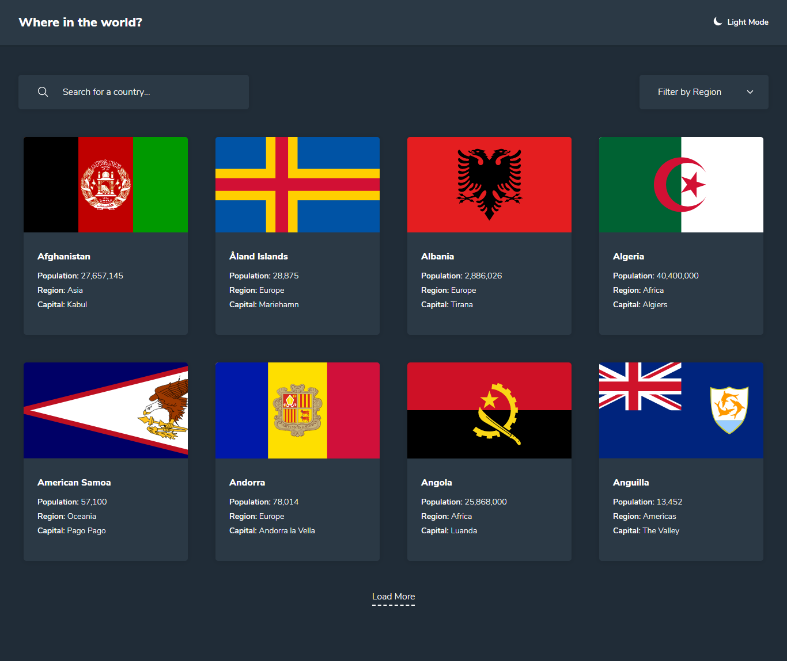
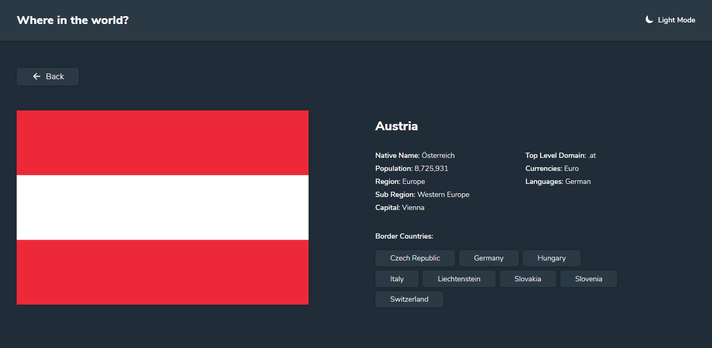
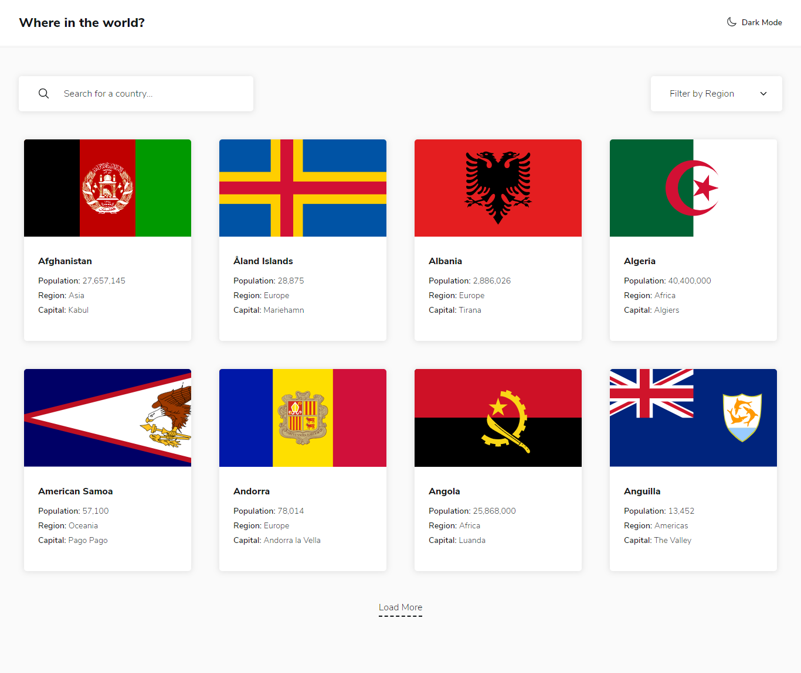
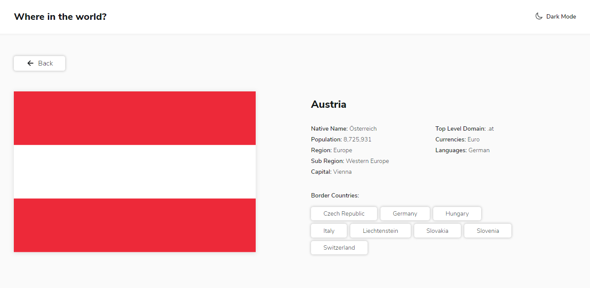

# Frontend Mentor - REST Countries API with color theme switcher

Live Solution [TODO]().

### Dark Theme

#### Home Page

#### Detail Page

### Light Theme

#### Home Page

#### Detail Page

 

[Frontend Mentor](https://www.frontendmentor.io) challenges allow you to improve your skills in a real-life workflow.
